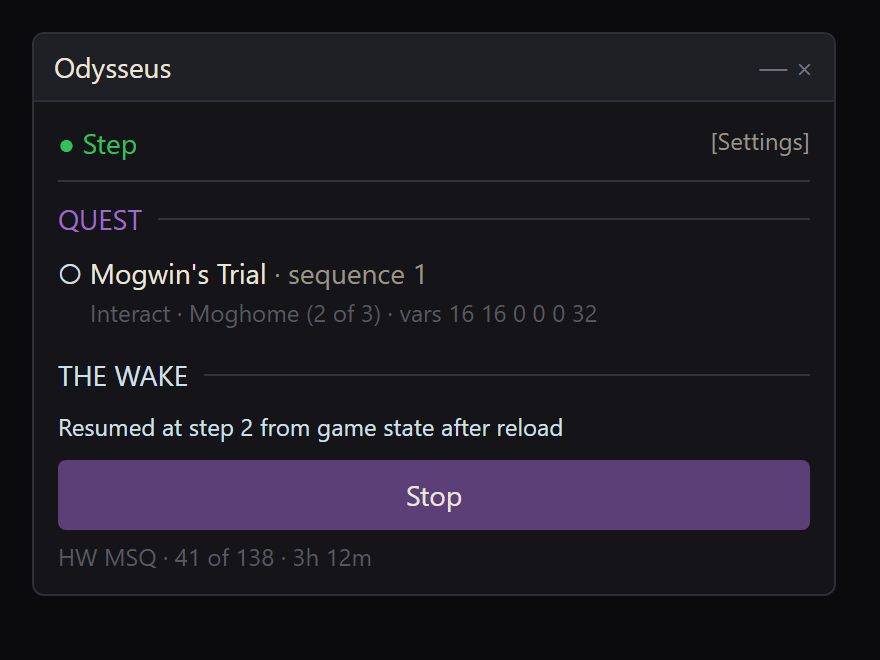
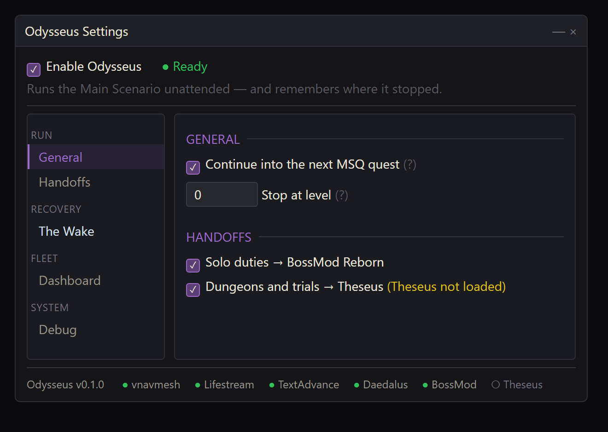
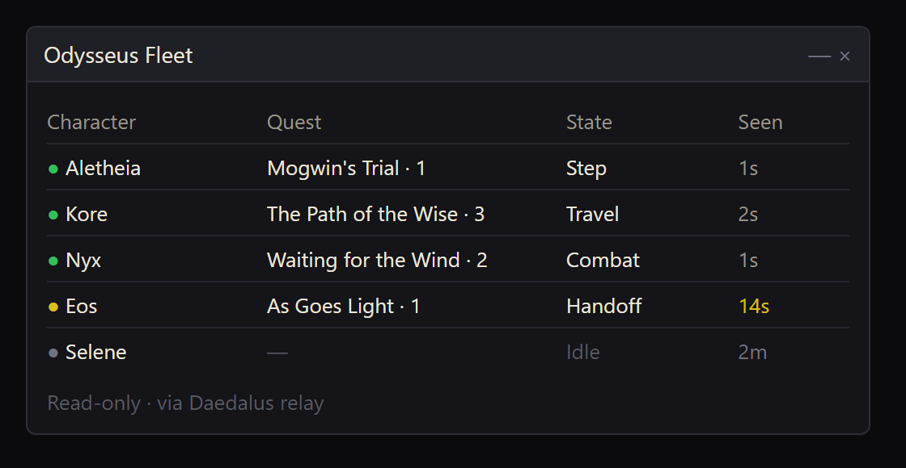

# Odysseus

**Runs the Main Scenario unattended — and remembers where it stopped.**

A Dalamud plugin for FFXIV that walks the Main Scenario quest by quest: travels to the right zone,
talks to the right NPC, makes the dialogue choices, fights what needs fighting, and hands
instanced content to the plugins that already do it — BossMod Reborn for solo duties, Theseus for
dungeons and trials.

Odysseus took the long way home. This plugin walks it the same way, and treats the wake behind
the ship as the feature that actually matters.

> **Status: early development.** The framework is in place; the quest engine is being built. Not
> yet usable for real runs.

## What makes it different

**It resumes — from the game, not from a file.** Quest, sequence and the quest's own progress
variables are all held server-side, so Odysseus reads them back rather than trusting anything it
saved. A crash, a logout, a plugin reload or a full client restart all pick up exactly where the
game says you are. The run window shows the live quest state and, in foam, what the Wake did
about it.



**It hands off instead of reimplementing.** Solo instances go to BossMod Reborn's AI. Dungeons and
trials inside a quest go to Theseus. Combat goes to Daedalus. Odysseus owns the quest and the
walk between; everything else is delegated to the plugin built for it. Each handoff is a toggle;
with it off, Odysseus walks to the entrance and waits for you.



**Fleet visibility, not fleet lockstep.** Every character quests independently. A read-only
dashboard shows where each box in the fleet is in the story, which state it is in, and when it
was last heard from.



> The screenshots above are design mockups of the intended UI, not captures of the running
> plugin.

## Dependencies

| Plugin | Role | Required |
|---|---|---|
| vnavmesh | pathfinding and movement | yes |
| Lifestream | aetheryte and aethernet travel | yes |
| TextAdvance | dialogue advance and cutscene skip | yes |
| Daedalus | rotation for quest combat; fleet relay | for combat / dashboard |
| BossMod Reborn | solo instanced duties | for solo duties |
| Theseus | dungeons and trials inside quests | for full duties |

A missing dependency is shown in the settings window and stops the run; it never crashes.

## Commands

- `/odysseus` — main window (`/od` for short)
- `/odysseus config` — settings
- `/odysseus debug` — live quest-state dump

## Install

Add the aggregate repository to Dalamud's custom plugin repositories:

```
https://raw.githubusercontent.com/ofnature/Daedalus/main/repo.json
```

## Building

```
dotnet build Odysseus.sln -c Debug
dotnet test Odysseus.Tests
```

Requires the Dalamud dev libraries at `%APPDATA%\XIVLauncher\addon\Hooks\dev\`.

## Licence

Odysseus is original work. It reads quest-path data from the user's own machine at runtime and
never redistributes third-party data.
